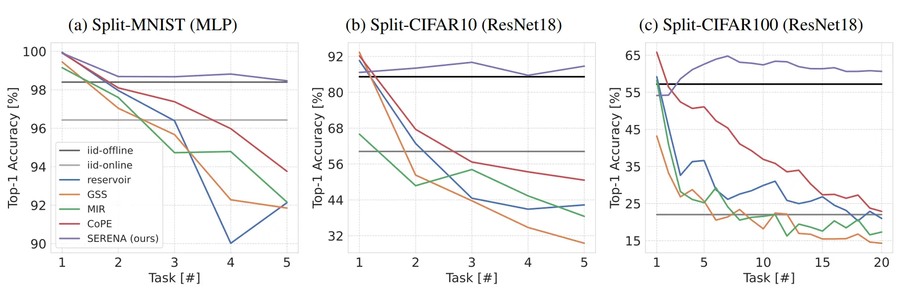
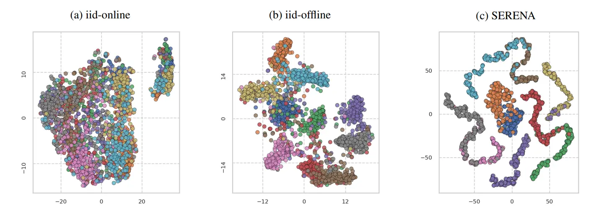

<div align="center">

</div>

<p align="center">
  <a href="#-introduction">🎉Introduction</a> •
  <a href="#-results">📝 Results</a> <br />
  <a href="#%EF%B8%8F-how-to-use">☄️How to Use</a> •
  <a href="#-acknowledgments">👨‍🏫Acknowledgments</a> •
  <a href="#-contact">🤗Contact</a>
</p>

## 🎉 Introduction
* Self-Regulated Neurogenesis for Online Data-Incremental Learning (SERENA) is a lightweight and efficient method for Online Data-Incremental Learning, designed to continually adapt to streaming data without forgetting past knowledge. It automatically detects emerging concepts and tasks on the fly and fine-tunes a randomly selected sparse subnetwork per task. By freezing previously used connections, SERENA prevents interference across tasks, achieving near-zero forgetting without expanding the model or relying on replay buffers. This enables continual fine-tuning of a shared backbone while keeping memory and compute overhead minimal.

## 📝 Results
<div align="center">
  
  
</div>


## ☄️ how to use

### 🕹️ Clone
Clone this GitHub repository:

```
git clone https://github.com/muratonuryildirim/SERENA.git
cd SERENA
```

### 🔑 Run experiment
For example, to train 20-Task CIFAR100, run:

```
python main.py
       --dataset cifar100
       --num_classes 100
       --num_tasks 20
       --num_classes_per_task 5
       --backbone resnet18
```

## 👨‍🏫 Acknowledgments
We thank the following repos for providing helpful components/functions in our work.
- [In-Time-Over-Parameterization](https://github.com/Shiweiliuiiiiiii/In-Time-Over-Parameterization)
- [PyCIL](https://github.com/G-U-N/PyCIL)


## 🤗 Contact
If there are any questions, please feel free to open an issue or contact the author **M. Onur Yildirim**([m.o.yildirim@tue.nl](mailto:m.o.yildirim@tue.nl)). Enjoy the code.

## License
Please check the [MIT license](./LICENSE) that is listed in this repository.

